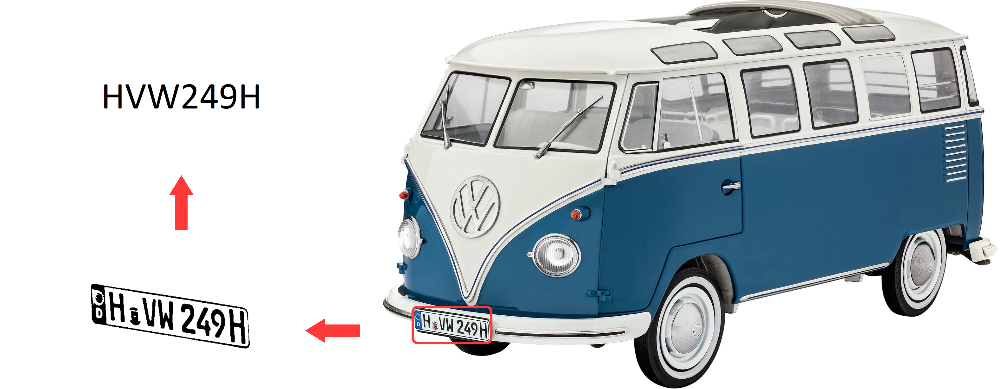

# Automatic Number Plate Recognition APP

Automatic number plate recognition (ANPR or LPR) is a surveillance and access control
method that uses optical character recognition in images to read vehicle license plates.
It first uses a series of image manipulation techniques to detect,
normalize and enhance the image of the license plate number,
and finally optical character recognition to extract the alphanumerics from the license plate.
ANPR technology tends to be region specific, due to the variation between license plates from place to place
but in this case I have try to train a unique model for many countries.

